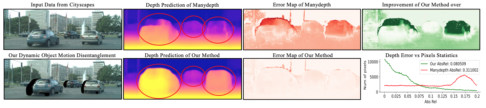
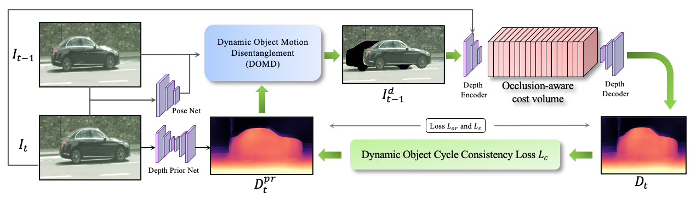

# Disentangling Object Motion and Occlusion for Unsupervised Multi-frame Monocular Depth

This paper has been accepted by [ECCV 2022](https://eccv2022.ecva.net/)

By [Ziyue Feng](https://ziyue.cool), [Liang Yang](https://ericlyang.github.io/), [Longlong Jing](https://longlong-jing.github.io/), [Haiyan Wang](https://haiyan-chris-wang.github.io/), [Yingli Tian](https://www.ccny.cuny.edu/profiles/yingli-tian), and [Bing Li](https://www.clemson.edu/cecas/departments/automotive-engineering/people/li.html).

Arxiv: [Link](https://arxiv.org/abs/2203.15174)
Youtube: [link](https://youtu.be/Gg6pLvFDdc4)
Project Site: [link](https://sites.google.com/view/dynamicdepth)

## Video
[](https://youtu.be/Gg6pLvFDdc4)

## Sample from Cityscapes dataset


## Architecture:



## ⚙️ Setup

You can install the dependencies with:

```shell
conda create -n dynamicdepth python=3.6.6
conda activate dynamicdepth
conda install pytorch torchvision torchaudio cudatoolkit=11.1 -c pytorch -c conda-forge
pip install tensorboardX==1.4
conda install opencv=3.3.1   # just needed for evaluation
pip install open3d
pip install wandb
pip install scikit-image
python -m pip install cityscapesscripts
```

We ran our experiments with PyTorch 1.8.0, CUDA 11.1, Python 3.6.6 and Ubuntu 18.04.

## 💾 Cityscapes Data Prepare

Pull the repository and make a folder named CS_RAW for cityscapes raw data:

```bash
git clone https://github.com/AutoAILab/DynamicDepth.git
cd DynamicDepth
cd data
mkdir CS_RAW
```

From [Cityscapes official website](https://www.cityscapes-dataset.com/) download the following packages: 1) `leftImg8bit_sequence_trainvaltest.zip`, 2) `camera_trainvaltest.zip` into the `CS_RAW` folder.

Preprocess the Cityscapes dataset using the `prepare_train_data.py`(from SfMLearner) script with following command:

```bash
cd CS_RAW
unzip leftImg8bit_sequence_trainvaltest.zip
unzip camera_trainvaltest.zip
cd ..

python prepare_train_data.py \
    --img_height 512 \
    --img_width 1024 \
    --dataset_dir CS_RAW \
    --dataset_name cityscapes \
    --dump_root CS \
    --seq_length 3 \
    --num_threads 8
```

Download cityscapes depth ground truth(provided by manydepth) for evaluation:
```bash
cd ..
cd splits/cityscapes/
wget https://storage.googleapis.com/niantic-lon-static/research/manydepth/gt_depths_cityscapes.zip
unzip gt_depths_cityscapes.zip
cd ../..
```

(Recommended)Download Manydepth pretrained model from [Here](https://drive.google.com/file/d/1Itlz4J5Wp45KV06yBnDsp06Opw-BC8Go/view?usp=sharing) and put in the log folder. Training from these weights will converge much faster.
```bash
mkdir log
cd log
# Download CityScapes_MR.zip to here 
unzip CityScapes_MR.zip
cd ..
```

Download dynamic object masks for Cityscapes dataset from ([Google Drive](https://drive.google.com/file/d/1cUCi5piNhpvli_rsKrh01eSvv6okrNvG/view?usp=sharing) or [OneDrive](https://clemson-my.sharepoint.com/:u:/g/personal/zfeng_clemson_edu/ETJLmJVJz4FBoBLMxJ53T5wB_uGpCqtr9TktJTKgYdgbHA?e=I1fbWC)) and extract the `train_mask` and `val_mask` folder to `DynamicDepth/data/CS/`.

## ⏳ Training

By default models and log event files are saved to `log/dynamicdepth/models`.

```shell
python -m dynamicdepth.train  # the configs are defined in options.py
```

## ⏳ Evaluating

`val()` function in the trainer.py evaluates the model on Cityscapes testing set.

## 📦 Pretrained model

You can download our pretrained model from the following links:

| CNN Backbone      | Input size  | Cityscapes AbsRel | Link                                                               |
|-------------------|-------------|:-----------------------------------:|----------------------------------------------------------------------------------------------|
| ResNet 18         | 640 x 192   |      0.104         | [Download 🔗](https://drive.google.com/file/d/1k3-7nki-v6k111wBZ-7pQNVU8QU7Nemx/view?usp=sharing)           |

## Citation

```
@article{feng2022disentangling,
  title={Disentangling Object Motion and Occlusion for Unsupervised Multi-frame Monocular Depth},
  author={Feng, Ziyue and Yang, Liang and Jing, Longlong and Wang, Haiyan and Tian, YingLi and Li, Bing},
  journal={arXiv preprint arXiv:2203.15174},
  year={2022}
}
```

## Reference

InstaDM: https://github.com/SeokjuLee/Insta-DM
ManyDepth: https://github.com/nianticlabs/manydepth

## Contact

If you have any concern with this paper or implementation, welcome to open an issue or email me at 'zfeng@clemson.edu'
